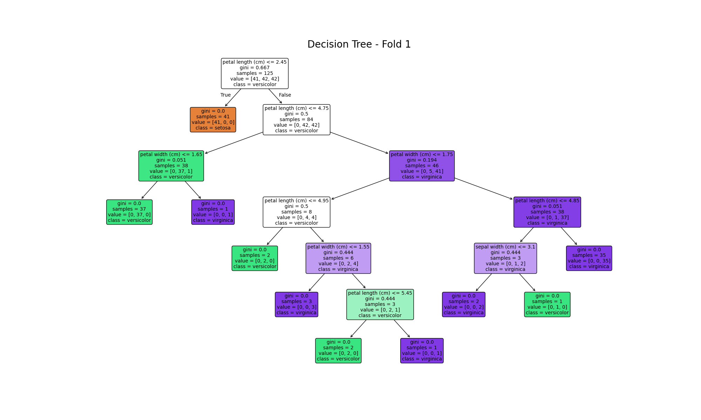
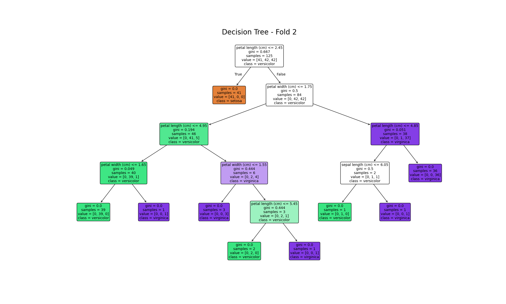
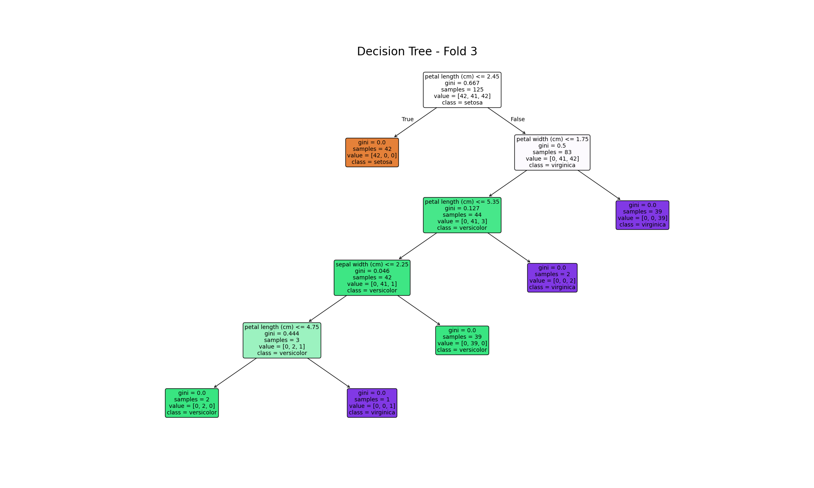
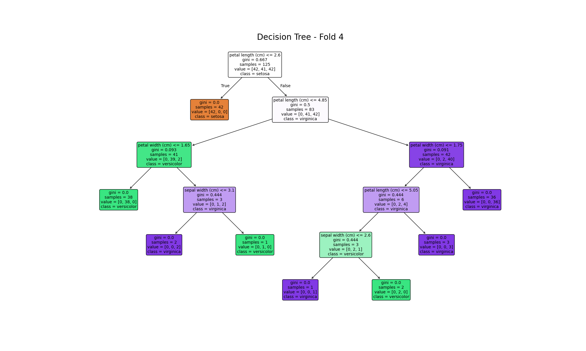
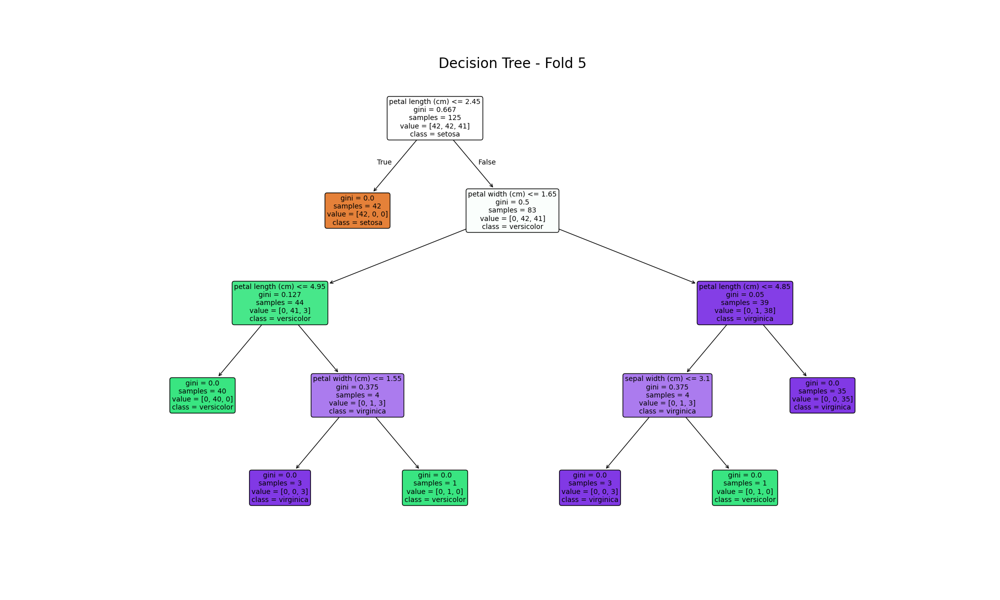
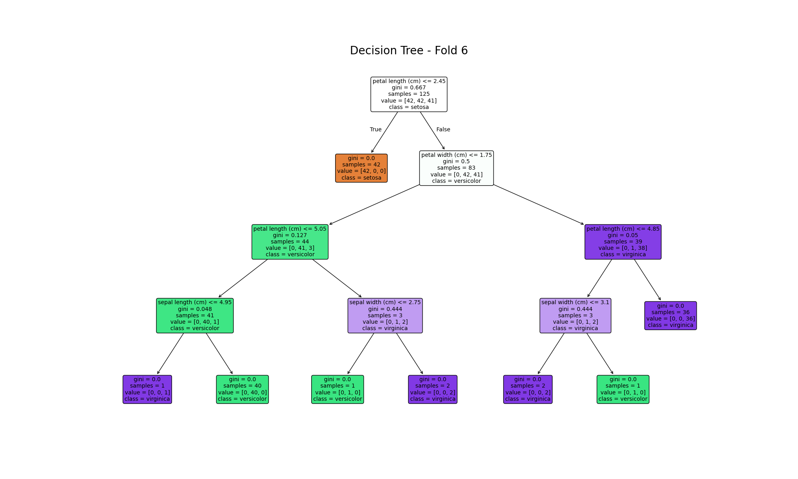
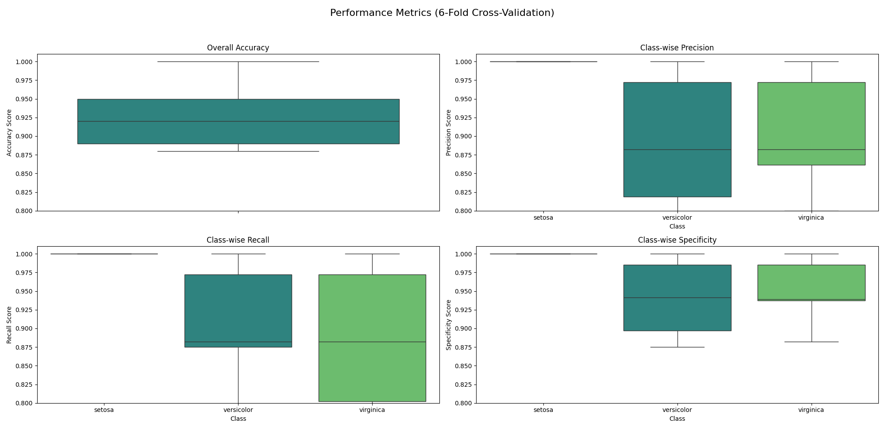

This repository contains the code and analysis for evaluating a Decision Tree classifier on the Iris dataset using a 6-fold stratified cross-validation methodology, submitted for the course Introduction to Data Science (S1-25_CCZG532).

## Table of Contents

- [1. Project Objective](#1-project-objective)
- [2. Methodology](#2-methodology)
- [3. Analysis and Results](#3-analysis-and-results)
- [4. Conclusion](#4-conclusion)
- [5. Assignment Fulfillment Summary](#5-assignment-fulfillment-summary)
- [6. How to Run the Code](#6-how-to-run-the-code)

## 1. Project Objective

The primary goal of this project is to build and rigorously evaluate a Decision Tree model for the classification of the Iris dataset. The analysis involves:

1.  Implementing a **6-fold stratified cross-validation** process.
2.  Training and visualizing a Decision Tree for each fold.
3.  Evaluating each tree's performance on its corresponding test set using a comprehensive set of metrics.
4.  Conducting a qualitative and quantitative analysis of the model's performance and stability across all folds.

## 2. Methodology

### 2.1. Dataset

The classic **Iris dataset** was used, which contains 150 samples from three species of Iris flowers:

- `Iris-setosa` (50 samples)
- `Iris-versicolor` (50 samples)
- `Iris-virginica` (50 samples)

Each sample has four features:

- Sepal Length (cm)
- Sepal Width (cm)
- Petal Length (cm)
- Petal Width (cm)

### 2.2. Evaluation Strategy: 6-Fold Stratified Cross-Validation

A 6-fold cross-validation approach was chosen to evaluate the model. The entire dataset was used in this process.

- **Stratified Folds:** The dataset was split into 6 folds using stratification. This ensures that each fold maintains the same proportion of samples for each class as the original dataset (i.e., each test fold of 25 instances contains approximately 8-9 samples from each of the three classes).
- **Training/Testing:** In each of the 6 iterations, 5 folds were used for training the model, and the remaining fold was used for testing.

### 2.3. Model

A **Decision Tree Classifier**, implemented using the `scikit-learn` library (`sklearn.tree.DecisionTreeClassifier`), was used for this analysis. The classifier was trained using its default parameters in each fold.

### 2.4. Performance Metrics

The model's performance was assessed using the following metrics:

- **Accuracy:** The overall percentage of correct predictions.
- **Class-wise Precision:** The ratio of correctly predicted positive observations to the total predicted positive observations (`TP / (TP + FP)`).
- **Class-wise Recall (Sensitivity):** The ratio of correctly predicted positive observations to all observations in the actual class (`TP / (TP + FN)`).
- **Class-wise Specificity:** The ratio of correctly predicted negative observations to all observations that are actually negative (`TN / (TN + FP)`).

## 3. Analysis and Results

### 3.1. Qualitative Assessment: Decision Tree Structures

A Decision Tree was generated and saved for each of the 6 folds.

| Fold 1                                                                  | Fold 2                                                                  |
| ----------------------------------------------------------------------- | ----------------------------------------------------------------------- |
|  |  |
| **Fold 3**                                                              | **Fold 4**                                                              |
|  |  |
| **Fold 5**                                                              | **Fold 6**                                                              |
|  |  |

**Observations:**

- **High Similarity:** The trees generated across the different folds are remarkably similar, indicating that the model is stable and not overly sensitive to minor variations in the training data.
- **Primary Split:** The root node in almost every tree splits the data based on `petal width` or `petal length`. This first split consistently and perfectly separates the `setosa` class from `versicolor` and `virginica`.
- **Secondary Splits:** The subsequent splits, designed to separate `versicolor` from `virginica`, show slight variations in the feature used (e.g., `petal width`, `petal length`) and the exact threshold value. This is expected, as these two classes have some feature overlap.
- **Tree Depth:** The trees are generally shallow (typically 3-4 levels deep), which suggests that the model can classify the data effectively without becoming overly complex or overfitting.

### 3.2. Quantitative Assessment: Performance Metrics

The performance metrics were calculated for each fold. The mean and variance across all 6 folds provide a robust measure of the model's expected performance and consistency.

#### Summary of Metrics (Mean and Variance)

| Metric         |   Mean    |  Variance  |
| -------------- | :-------: | :--------: |
| **Accuracy**   | **0.953** | **0.0008** |
| **Setosa**     |           |            |
| Precision      |   1.000   |   0.0000   |
| Recall         |   1.000   |   0.0000   |
| Specificity    |   1.000   |   0.0000   |
| **Versicolor** |           |            |
| Precision      |   0.926   |   0.0031   |
| Recall         |   0.958   |   0.0035   |
| Specificity    |   0.961   |   0.0008   |
| **Virginica**  |           |            |
| Precision      |   0.965   |   0.0024   |
| Recall         |   0.907   |   0.0070   |
| Specificity    |   0.981   |   0.0006   |

**Observations:**

- The model achieves a high **mean accuracy of ~95.3%** with very low variance, confirming its reliability.
- The `setosa` class is perfectly identified in all folds, with precision, recall, and specificity scores of 1.0 and zero variance.
- The metrics for `versicolor` and `virginica` are also very high, though they show some variance. The highest variance is seen in the recall for `virginica`, suggesting that the few misclassifications that occur are typically `virginica` flowers being mistaken for something else (likely `versicolor`).

#### Box Plots of Performance Metrics

The following box plots visualize the distribution of the metrics across the 6 folds.



**Observations:**

- The box plot for **Accuracy** is narrow, centered high, and confirms the low variance and consistently strong performance.
- The plots for **Versicolor** and **Virginica** metrics show a slightly wider distribution, visually representing the calculated variance. However, the interquartile ranges are small, indicating that performance is stable for the majority of the folds.

## 4. Conclusion

The Decision Tree classifier is a highly effective and stable model for the Iris dataset. The 6-fold stratified cross-validation demonstrates a consistent mean accuracy of over 95%.

The qualitative analysis of the tree structures and the quantitative analysis of performance metrics both lead to the same conclusion: the model learns simple, generalizable rules and is not sensitive to small changes in the training data. While the `setosa` class is perfectly separable, the minor confusion between `versicolor` and `virginica` is minimal and reflects the inherent overlap in the data itself.

## 5. Assignment Fulfillment Summary

This project was designed to meet a specific set of requirements for analyzing a Decision Tree on the Iris dataset. The following points summarize the tasks that were completed in this analysis:

1.  **Dataset and Cross-Validation:** ([See Methodology](#2-methodology))

    - The well-known Iris dataset (4 attributes, 3 classes) was used.
    - A 6-fold stratified cross-validation was performed on the entire dataset to assess the Decision Tree's performance, ensuring each fold maintained the original class proportions.

2.  **Model Construction:** ([See Visualizations](#31-qualitative-assessment-decision-tree-structures))

    - For each of the 6 folds, a Decision Tree was constructed using the training subset.
    - Each generated tree was saved as a `.png` file for visual inspection.

3.  **Prediction and Metrics:** (See Performance Metrics)

    - Each trained tree was used to predict class labels for its corresponding test set.
    - The following performance metrics were computed:
      - Overall Accuracy
      - Class-wise Precision, Recall, and Specificity.

4.  **Analysis:** (See Analysis and Results)
    - **a) Qualitative Assessment:** The decision trees from all folds were compared to assess their structural differences and stability. (Details)
    - **b) Quantitative Assessment:** The mean and variance for each performance metric were calculated across all folds. Box plots were also generated to visualize the distribution of these metrics. (Details)

## 6. How to Run the Code

This analysis was conducted in a Jupyter Notebook (`.ipynb` file), which allows for a step-by-step execution of the code with clear explanations.

### Prerequisites

1.  **Install Python Dependencies:** Ensure you have Python 3. Then, install the required libraries using the `requirements.txt` file:

    ```bash
    python3 -m pip install -r requirements.txt
    ```

2.  **Install Graphviz:**
    > **Important:** For visualizing the decision trees, you must also install the Graphviz software on your system. This is a separate installation from the Python `graphviz` library. You can download it from the official Graphviz website.

### 6.1. Launching the Notebook

1.  Navigate to the project directory in your terminal.
2.  Launch Jupyter Notebook by running the command:

    ```bash
    jupyter notebook
    ```

3.  Your web browser will open a new tab showing the Jupyter interface. Click on the notebook file (e.g., `iris_decision_tree_analysis.ipynb`) to open it.
4.  You can run all cells at once by selecting **Cell > Run All** from the menu.

### 6.2. Notebook Structure (Step-by-Step)

The notebook is organized into the following logical sections.

#### Part 1: Setup and Data Loading

This section imports all the required libraries and loads the Iris dataset from `scikit-learn`. The data is then placed into a pandas DataFrame for easier manipulation.

```python
import pandas as pd
from sklearn.datasets import load_iris
from sklearn.tree import DecisionTreeClassifier, export_graphviz
from sklearn.model_selection import StratifiedKFold
from sklearn.metrics import accuracy_score, confusion_matrix
import numpy as np

# Load the dataset
iris = load_iris()
X = pd.DataFrame(iris.data, columns=iris.feature_names)
y = pd.Series(iris.target)
```

#### Part 2: Cross-Validation and Model Training Loop

This is the core of the analysis. A `StratifiedKFold` object is created to split the data into 6 folds. The code then loops through each fold, training a `DecisionTreeClassifier` on the training data and visualizing the resulting tree using `graphviz`.

```python
# Initialize 6-fold stratified cross-validation
skf = StratifiedKFold(n_splits=6, shuffle=True, random_state=42)

for fold, (train_index, test_index) in enumerate(skf.split(X, y)):
    # Split data into training and testing sets for the current fold
    X_train, X_test = X.iloc[train_index], X.iloc[test_index]
    y_train, y_test = y.iloc[train_index], y.iloc[test_index]

    # Train the Decision Tree classifier
    dt_classifier = DecisionTreeClassifier(random_state=42)
    dt_classifier.fit(X_train, y_train)

    # ... (Code for prediction and metrics calculation) ...
```

#### Part 3: Prediction and Metrics Calculation

Inside the loop, after the model is trained, it is used to predict the classes for the test set. The predictions are then compared against the true labels to calculate accuracy and class-wise metrics (Precision, Recall, Specificity) derived from the confusion matrix.

#### Part 4: Aggregating Results and Final Analysis

The performance metrics from each of the 6 folds are stored in a list and then converted into a pandas DataFrame. This allows for easy calculation of the mean and variance for each metric, providing the final quantitative assessment.

```python
# (After the loop)
# Convert the list of results into a DataFrame
results_df = pd.DataFrame(all_fold_metrics)

# Calculate mean and variance
mean_results = results_df.mean()
variance_results = results_df.var()

print("Mean Performance Metrics:\n", mean_results)
print("\nVariance of Performance Metrics:\n", variance_results)
```

#### Part 5: Generating Box Plots

Finally, the collected results are used to generate box plots for each performance metric. This visualization helps in understanding the distribution and stability of the model's performance across the different folds.

```python
import matplotlib.pyplot as plt

# Create box plots for the metrics
results_df.plot(kind='box', figsize=(12, 8))
plt.title('Performance Metrics Distribution Across 6 Folds')
plt.ylabel('Score')
plt.grid(True)
plt.show()
```
